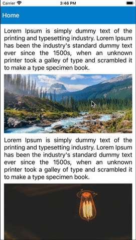
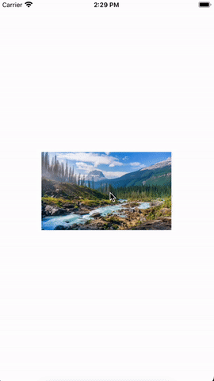

# react-native-images-preview

## [](https://www.npmjs.org/package/react-native-images-preview) [](https://www.android.com) [](https://developer.apple.com/ios) [](https://opensource.org/licenses/MIT)

Introducing an image preview built with pure JavaScript and leveraging React Native Reanimated and GesturesHandler, enabling full-screen image previewing and zooming via double-tap and pinch gestures for effortless integration into applications.

Our library is designed to be highly customizable, allowing developers to tailor it to their specific needs, such as changing the colors, styles, and other visual elements. Whether you're an Android or iOS user, our library is compatible with both platform, guaranteeing optimal performance.

## 🎬 Preview

|               Simple                |               SwipeDown Close               |
| :---------------------------------: | :-----------------------------------------: |
|  |  |

|             DoubleTap Zoom             |               Pinch Zoom               |
| :------------------------------------: | :------------------------------------: |
|  |  |

## Quick Access

- [Installation](#installation)
- [Usage and Examples](#usage)
- [Properties](#properties)
- [Example Code](#example)
- [License](#license)

## Getting Started 🔧

Here's how to get started with react-native-images-preview in your React Native project:

### Installation

#### 1. Install the package

Using `npm`:

```sh
npm install react-native-images-preview react-native-reanimated react-native-gesture-handler
```

Using `yarn`:

```sh
yarn add react-native-images-preview react-native-reanimated react-native-gesture-handler
```

##### 2. Install cocoapods in the ios project

```sh
cd ios && pod install
```

> Note: Make sure to add Reanimated's babel plugin to your`babel.config.js`

```sh
module.exports = {
      ...
      plugins: [
          ...
          'react-native-reanimated/plugin',
      ],
  };
```

> Note: For React Native 0.61 or greater, add react-native-gesture-handler in index.js file.

```sh
import 'react-native-gesture-handler';
```

##### Know more about [react-native-reanimated](https://www.npmjs.com/package/react-native-reanimated) and [react-native-gesture-handler](https://www.npmjs.com/package/react-native-gesture-handler)

## Usage

```jsx
import React from 'react';
import { StyleSheet, View } from 'react-native';
import { ImagePreview } from 'react-native-images-preview';
import { images } from './assets';

const App = () => {
  return (
    <View style={styles.screen}>
      <ImagePreview
        imageSource={images.forest}
        imageStyle={styles.imageStyle}
      />
    </View>
  );
};

export default App;

const styles = StyleSheet.create({
  screen: {
    flex: 1,
    justifyContent: 'center',
    alignItems: 'center',
  },
  imageStyle: {
    height: 150,
    width: 250,
  },
});
```

#### 🎬 Preview



## Properties

| Props                 | Default |          Type           | Description                                                                                          |
| :-------------------- | :-----: | :---------------------: | :--------------------------------------------------------------------------------------------------- |
| **imageSource**       |    -    |   ImageSourcePropType   | Source of image                                                                                      |
| **imageStyle**        |    -    | `StyleProp<ImageStyle>` | Styling of image                                                                                     |
| imageProps            |    -    |       ImageProps        | Provide <a href="https://reactnative.dev/docs/image#props"> image props </a>                         |
| swipeDownCloseEnabled |  true   |         boolean         | Enable/Disable swipe down to close modal                                                             |
| doubleTapZoomEnabled  |  true   |         boolean         | Enable/Disable double tap to zoom                                                                    |
| pinchZoomEnabled      |  true   |         boolean         | Enable/Disable pinch to zoom                                                                         |
| renderHeader          |    -    |        function         | Call back function to render custom header and provide `close()` in argument                         |
| renderImageLoader     |    -    |        function         | Call back function to render custom image loader                                                     |
| errorImageSource      |    -    |   ImageSourcePropType   | Source of error image                                                                                |
| imageLoaderProps      |    -    | ActivityIndicatorProps  | Provide <a href="https://reactnative.dev/docs/activityindicator#props"> ActivityIndicator props </a> |

##### Know more about [ImageProps](https://reactnative.dev/docs/image#props), [ActivityIndicatorProps](https://reactnative.dev/docs/activityindicator#props)

## Example

A full working example project is here [Example](./example/src/App.tsx)

```sh
yarn
yarn example ios   // For ios
yarn example android   // For Android
```

## Find this library useful? ❤️

Support it by joining [stargazers](https://github.com/SimformSolutionsPvtLtd/react-native-images-preview/stargazers) for this repository.⭐

## Bugs / Feature requests / Feedbacks

For bugs, feature requests, and discussion please use [GitHub Issues](https://github.com/SimformSolutionsPvtLtd/react-native-images-preview/issues/new?labels=bug&late=BUG_REPORT.md&title=%5BBUG%5D%3A), [GitHub New Feature](https://github.com/SimformSolutionsPvtLtd/react-native-images-preview/issues/new?labels=enhancement&late=FEATURE_REQUEST.md&title=%5BFEATURE%5D%3A), [GitHub Feedback](https://github.com/SimformSolutionsPvtLtd/react-native-images-preview/issues/new?labels=enhancement&late=FEATURE_REQUEST.md&title=%5BFEEDBACK%5D%3A)

## 🤝 How to Contribute

We'd love to have you improve this library or fix a problem 💪
Check out our [Contributing Guide](CONTRIBUTING.md) for ideas on contributing.

## Awesome Mobile Libraries

- Check out our other [available awesome mobile libraries](https://github.com/SimformSolutionsPvtLtd/Awesome-Mobile-Libraries)

## License

- [MIT License](./LICENSE)
