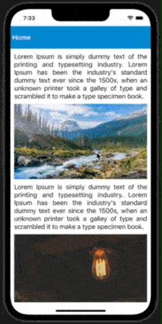

# react-native-images-preview

## [](https://www.npmjs.org/package/react-native-images-preview) [](https://www.android.com) [](https://developer.apple.com/ios) [](https://opensource.org/licenses/MIT)

React Native component for previewing image in full screen, with zooming enabled through double tap and pinch gestures.

---

## Installation

##### 1. Install animation catalog

```bash
$ npm install react-native-images-preview
# --- or ---
$ yarn add react-native-images-preview
```

##### 2. Install required dependencies

```bash
$ npm install react-native-reanimated react-native-gesture-handler
# --- or ---
$ yarn add react-native-reanimated react-native-gesture-handler
```

##### 3. Install cocoapods in the ios project

```bash
cd ios && pod install
```

> Note: Make sure to add Reanimated's babel plugin to your `babel.config.js`

```sh
module.exports = {
      ...
      plugins: [
          ...
          'react-native-reanimated/plugin',
      ],
  };
```

> Note: For React Native 0.61 or greater, add react-native-gesture-handler in index.js file:

```sh
import 'react-native-gesture-handler';
```

# Example

A full working example project is here [Example](./example/src/App.tsx)

```
$ yarn
$ yarn example ios   // For ios
$ yarn example android   // For Android
```

## 🎬 Preview



| Simple         | SwipeDown Close |
|----------------|-----------------|
|||

| DoubleTap Zoom | Pinch Zoom      |
|----------------|-----------------|
|||

## Usage

```jsx
import { View, Image, StyleSheet } from 'react-native';
import React from 'react';
import { ImagePreview } from 'react-native-images-preview';
import { images } from './assets';

const App = () => {
  return (
    <View style={styles.screen}>
      <ImagePreview
        imageSource={images.forest}
        imageStyle={styles.imageStyle}
      />
    </View>
  );
};

export default App;

const styles = StyleSheet.create({
  screen: {
    flex: 1,
    justifyContent: 'center',
    alignItems: 'center',
  },
  imageStyle: {
    height: 200,
    width: 200,
  },
});
```

## Properties

|    Props     | Default |                   Type                    |                                Description                                 |
| :----------: | :-----: | :---------------------------------------: | :------------------------------------------------------------------------: |
| customHeader |    -    | (close: () => void) => React.ReactElement |                      Add your custom header component                      |
| imageSource  |    -    |            ImageSourcePropType            |                              Source of image                               |
|  imageStyle  |    -    |           `StyleProp<ImageStyle>`           |                              Styling of image                              |
|  imageProps  |    -    |                ImageProps                 | Provide <a href="https://reactnative.dev/docs/image#props">image</a> props |
| doubleTapZoomEnabled |    true    | boolean |                      enable/disable double tap to zoom                     |
| pinchZoomEnabled |    true    | boolean |                      enable/disable pinch to zoom                     |
| swipeDownCloseEnabled |    true    | boolean |                      enable/disable swipe down to close modal                     |


---

## Find this library useful? ❤️

Support it by joining [stargazers](https://github.com/SimformSolutionsPvtLtd/react-native-images-preview/stargazers) for this repository.⭐

## Bugs / Feature requests / Feedbacks

For bugs, feature requests, and discussion please use [GitHub Issues](https://github.com/SimformSolutionsPvtLtd/react-native-images-preview/issues/new?labels=bug&late=BUG_REPORT.md&title=%5BBUG%5D%3A), [GitHub New Feature](https://github.com/SimformSolutionsPvtLtd/react-native-images-preview/issues/new?labels=enhancement&late=FEATURE_REQUEST.md&title=%5BFEATURE%5D%3A), [GitHub Feedback](https://github.com/SimformSolutionsPvtLtd/react-native-images-preview/issues/new?labels=enhancement&late=FEATURE_REQUEST.md&title=%5BFEEDBACK%5D%3A)

## 🤝 How to Contribute

We'd love to have you improve this library or fix a problem 💪
Check out our [Contributing Guide](CONTRIBUTING.md) for ideas on contributing.

## Awesome Mobile Libraries

- Check out our other [available awesome mobile libraries](https://github.com/SimformSolutionsPvtLtd/Awesome-Mobile-Libraries)

## License

- [MIT License](./LICENSE)
